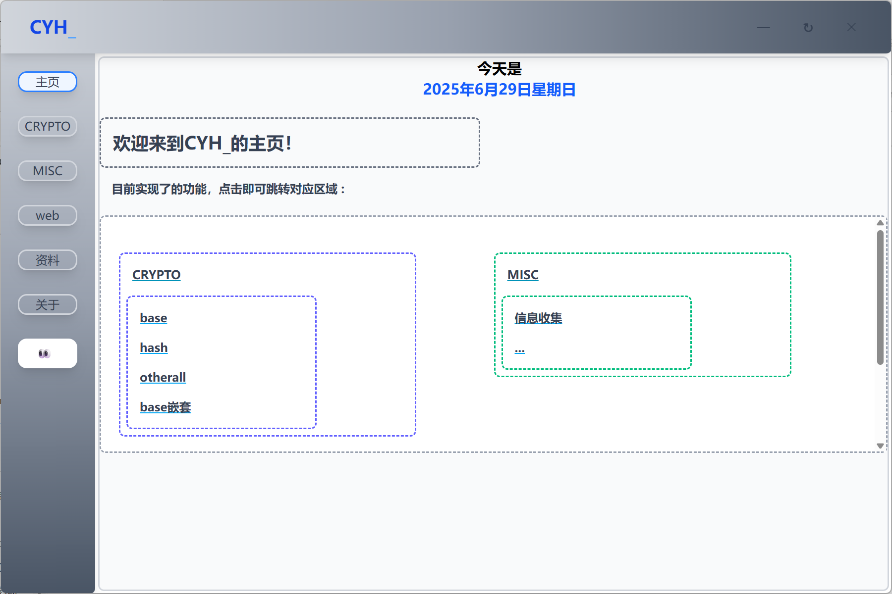
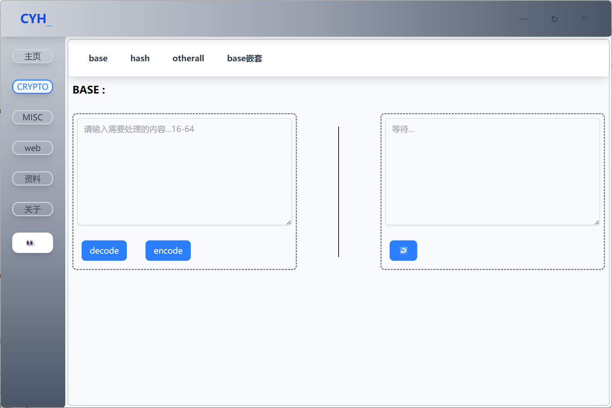
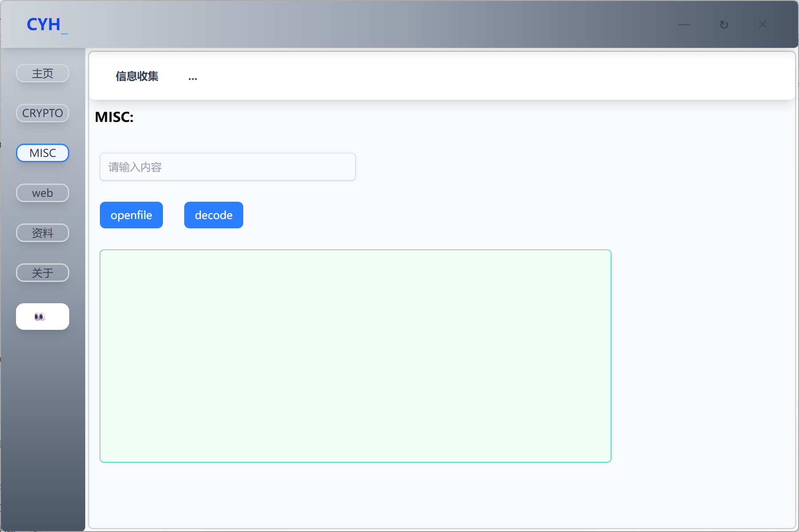
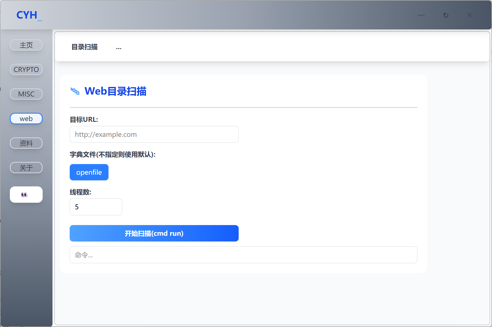
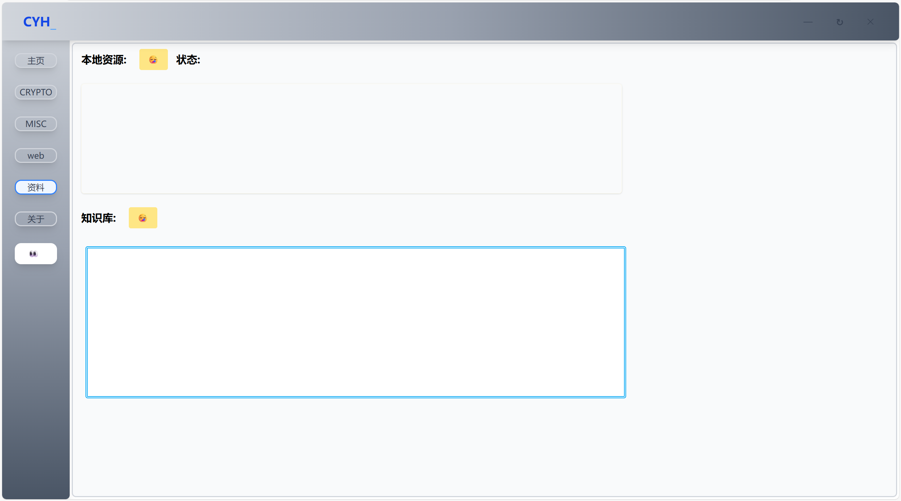
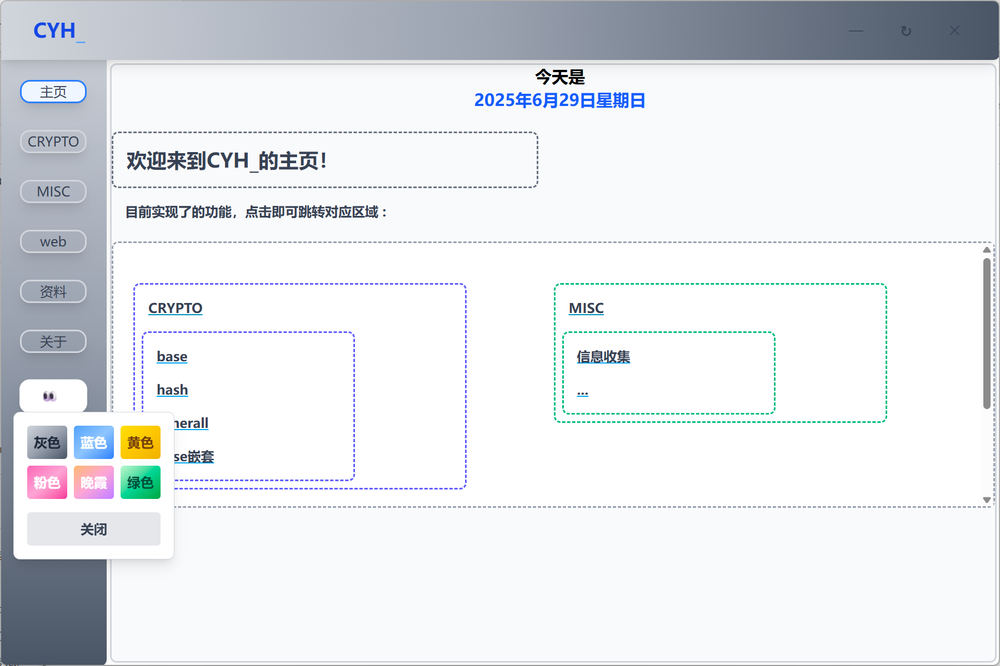

# 🎉CYH_

**下载：[Releases · huihuilikaile/CYH_](https://github.com/huihuilikaile/CYH_/releases)**

## 🚩 go学习之路

**CYH_ ➡️ wails 构建的一个gui工具，用于ctf竞赛...**

## ✅ CYH_ 实现功能

**主页:**

**点击可以跳转相应功能区**

**crypto：**

**base base嵌套 古典 hsah**

**misc:**

**信息收集**

**web:**

**目录扫描**

**资源：**

**本地exe启动**

**本地md储存**

**在tools目录下可以修改相关信息，点击黄色小表情可以刷新**

**切换主题：**

**点击眼睛按钮可以弹出主题切换窗口，目前六种配色**

## ⌚ 计划

**增加更多实用的功能，深入学习go语言&前端美化**

**交流：qq群： 921416626**